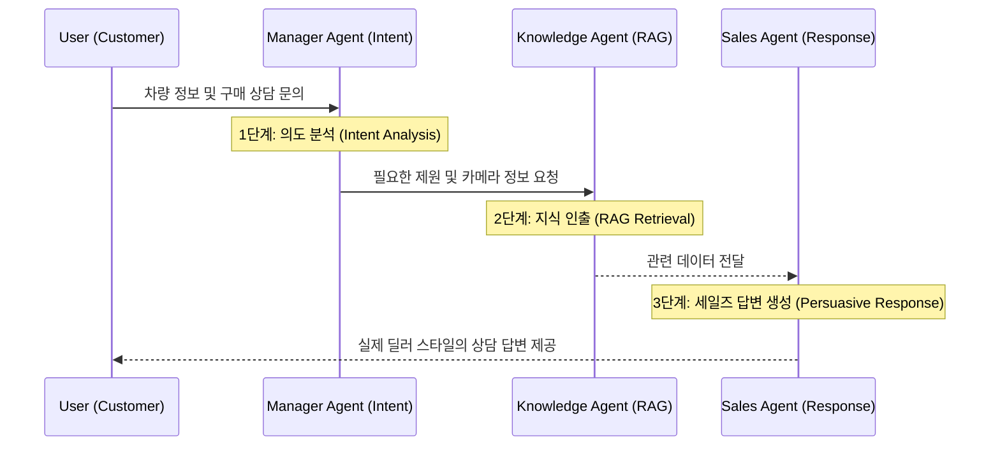

## 1. Project Overview

실제 차량 촬영 데이터를 활용해 **고화질 3D 시각화(3D Gaussian Splatting)** 와  
**Multi-Agent RAG 기반 AI 세일즈 도슨트**를 결합한 기업 연계 캡스톤 프로젝트입니다.

- **도메인**: 자동차 세일즈 / 디지털 쇼룸
- **목표**
  - 사용자가 웹 환경에서 차량을 자유롭게 회전·확대하며 살펴볼 수 있는 3D 디지털 트윈 제공
  - 실제 딜러처럼 차량 제원·옵션·카메라 포인트를 설명해 주는 AI 상담 경험 제공
- **본인 역할**
  - 3DGS 모델링 파이프라인 최적화 및 렌더링 품질·성능 튜닝
  - LangChain 기반 Multi-Agent 추론 로직 설계 및 프롬프트 구조 설계

---

## 2. System Architecture (3-Step Reasoning)

아래 다이어그램은 Manager / Knowledge / Sales 세 개의 에이전트가  
**3단계 추론 프로세스**로 협력하는 구조를 나타냅니다.

- **Manager Agent**
  - 사용자의 발화를 intent 단위로 분류 (차량 제원 / 옵션 비교 / 예산 제약 등)
  - 필요한 정보 타입을 정의하고 Knowledge Agent에게 질의
- **Knowledge Agent (RAG)**
  - 벡터 스토어에 저장된 차량 제원, 옵션, 카메라 포인트 등의 지식을 검색
  - 검증된 문서 조각만 Sales Agent에게 전달
- **Sales Agent**
  - 검색된 정보를 바탕으로, 설득력 있는 세일즈 톤으로 응답 생성
  - 동일한 질문에도 사용자 컨텍스트(예산, 선호 옵션 등)에 맞춰 답변 조정

---

## 3. Key Technical Challenges & Solutions

### 3.1 3DGS 웹 렌더링 성능 최적화

- **Challenge**
  - 고해상도 차량 촬영 데이터로부터 생성된 3DGS 모델은 포인트 수가 많아,
    웹 환경에서 초기 로딩 속도와 인터랙션 성능이 떨어질 수 있음.
- **Solution**
  - 포인트 클라우드 다운샘플링 및 중요도 기반 필터링으로 모델 경량화
  - WebGL 기반 경량 뷰어 라이브러리와 연동해 브라우저 렌더링 파이프라인 최적화
  - 결과적으로 **로딩 속도 약 40% 개선** 및 인터랙션 지연 최소화

### 3.2 RAG 답변 신뢰도 및 상담 전문성 확보

- **Challenge**
  - 단순한 RAG 구조에서는 차량 제원과 세일즈 스크립트가 섞여,
    환각(hallucination)과 비전문적인 답변이 발생할 위험이 큼.
- **Solution**
  - **3-Step Reasoning** 구조 도입:
    1. Manager Agent에서 의도 분석 및 질의 스펙 정의
    2. Knowledge Agent에서 검증된 KB 기반 정보만 인출
    3. Sales Agent에서 세일즈 톤과 도메인 제약을 반영해 최종 응답 생성
  - KB 스키마를 제원/옵션/카메라 포인트/세일즈 스크립트로 나누어 관리
  - 이 구조를 통해 **환각을 체계적으로 줄이고**, 상담 톤·내용의 일관성을 확보

---

## 4. Results & Impact

- 사용자는 별도의 앱 설치 없이 **브라우저에서 고품질 3D 차량 디지털 트윈**을 체험할 수 있음
- 실제 딜러와 유사한 상담 경험을 제공해,  
  차량 옵션 비교·추천 과정에서 **설득력 있는 설명과 맥락 있는 제안** 가능
- 기업 입장에서는 촬영 데이터 재활용을 통해 **디지털 쇼룸/온라인 세일즈 채널**을 확장할 수 있는 PoC

---

## 5. Tech Stack

- **3D Vision**
  - 3D Gaussian Splatting
  - 포인트 클라우드 전처리 및 최적화 파이프라인
- **LLM & RAG**
  - LangChain 기반 Multi-Agent 오케스트레이션
  - Vector Store 기반 Retrieval (KB 설계 및 인덱싱)
- **Web**
  - WebGL 기반 3D 뷰어
  - REST API / 웹 프론트엔드 연동

