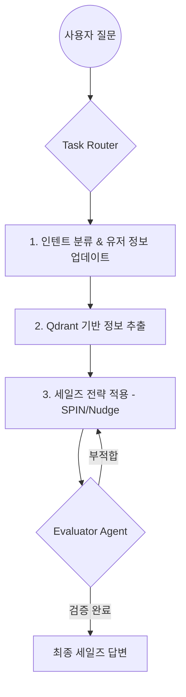

> **"정보 비대칭 해소를 넘어, 오프라인 전문 딜러의 세일즈 전략을 데이터와 AI로 재현하다."**

## 1. Project Background
중고차 시장의 고질적인 문제인 **'정보 비대칭'**과 고관여 제품 특유의 온라인 구매 불안감을 해소하기 위해 기획되었습니다. 단순 검색과 필터링을 넘어, 고객의 잠재 니즈를 발굴하고 구매 결정까지 돕는 **멀티모달 세일즈 에이전트** 구축을 목표로 했습니다.

<video 
  src="https://r2.taeya.org/k-masa_video.mp4" 
  controls 
  autoplay 
  muted 
  loop 
  poster="/assets/img/projects/video-thumbnail.jpg"
  style="width: 100%; border-radius: 12px; box-shadow: 0 4px 20px rgba(0,0,0,0.1);">
</video>

## 2. Key Tech Stack
- **Vision:** 3D Gaussian Splatting (3DGS) 기반 차량 시각화
- **LLM & Framework:** OpenAI GPT API, LangChain (Multi-Agent Orchestration)
- **Database:** Qdrant Vector DB (RAG 기반 지식 베이스)
- **Strategy:** SPIN Selling, Nudge 기법 기반 Prompt Engineering

## 3. Core Architecture & Logic

### 🚀 3단계 전략적 추론 (3-Step Reasoning)
단순한 Q&A 챗봇과의 차별화를 위해 전문 딜러의 사고방식을 에이전트화했습니다.

1. **Phase 1: Intent Analysis (의도 추론)**
   - 대화 이력을 바탕으로 고객을 `Cold`(정보탐색), `Warm`(후보탐색), `Hot`(구매확정) 리드로 분류하고 현재 목표(구매 목적, 예산 등)를 식별합니다.
2. **Phase 2: Knowledge Retrieval (RAG)**
   - 질문에 꼭 필요한 섹션(`inspection_record`, `insurance_history` 등)만 선별하여 Qdrant DB에서 관련 데이터를 정밀하게 추출합니다.
3. **Phase 3: Strategic Action (세일즈 전략 적용)**
   - **SPIN 기법**(상황, 문제, 시사, 해결가치)과 **Nudge 전략**을 결합하여 고객의 구매 장벽을 해소하는 개인화된 설득 답변을 생성합니다.

### 🛡️ 정보 무결성을 위한 Evaluator Agent
생성된 답변의 신뢰도를 높이기 위해 자가 평가 루프를 구축했습니다.
- **데이터 무결성:** RAG 검색 결과와 답변 내용의 일치 여부 검증 (오류 시 0점 처리).
- **인텐트 정합성:** 고객의 리드 상태에 적절한 액션(플랜 A/B/C)인지 판별.

## 4. Technical Challenges & Solutions

### 🧠 암묵지의 데이터화 (Knowledge Engineering)
- **Challenge:** 숙련된 딜러의 설득 기술은 경험 기반의 직관(암묵지)이어서 LLM에 직접 주입하기 어려움.
- **Solution:** 닐 래컴의 **SPIN Selling** 방법론과 **'Grammar of the Shot'** 등 카메라 공학 고전서의 지식을 데이터 규격으로 변환하여 시스템 프롬프트 및 지식 베이스 구축.

### 📊 사용자 경험 검증
- **Evaluation:** 실제 사용자 설문을 통해 **3D 시각화와 에이전트 상담의 결합**이 정보 이해도와 구매 신뢰도를 유의미하게 향상시킴을 확인 (첨부된 설문 데이터 기반).

## 5. System Flow (Mermaid Diagram)

