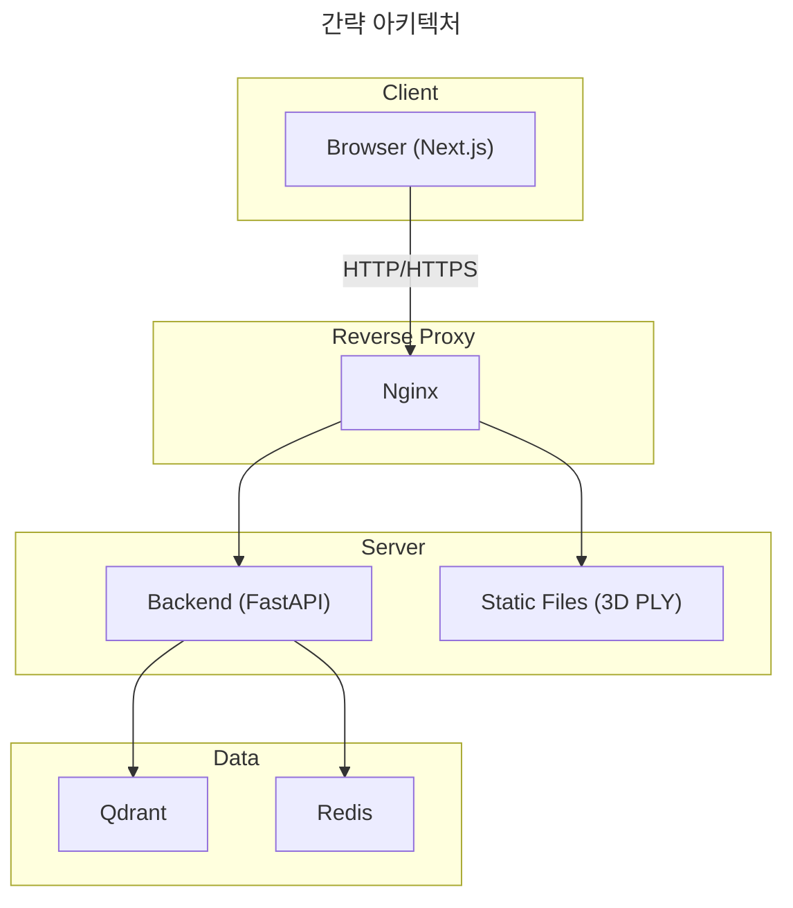
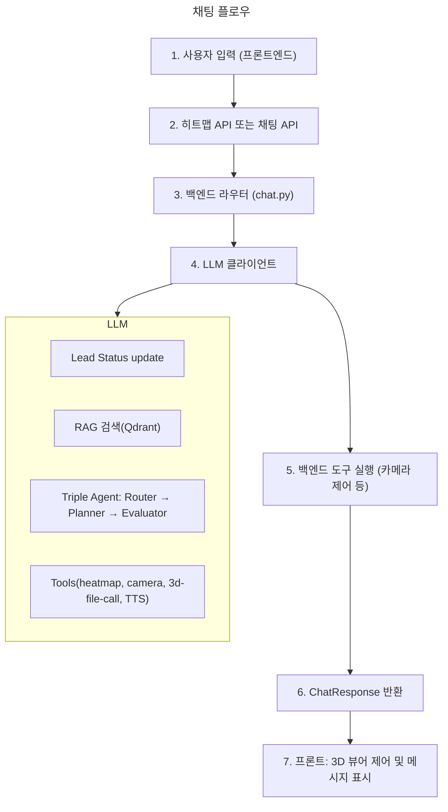

import ImageGallery from '../components/features/ImageGallery.astro';
import R2VideoPlayerEmbed from '../components/features/R2VideoPlayerEmbed.astro';

## 1. 개요
- 중고차 시장의 고질적인 문제인 **정보 비대칭**과 고관여 제품 특유의 **온라인 구매 불안감**을 해소하기 위해 기획함
- 단순 검색과 필터링을 넘어 고객의 잠재 니즈를 발굴하고 구매 결정까지 돕는 **멀티모달 세일즈 에이전트** 구축을 목표로 함

---

## 2. 문제 정의

#### 1. 단순 추천 시스템
- 기존 타사 상담 챗봇은 단순 필터링 기반 추천, FAQ 위주의 시스템임
#### 2. 세일즈 전략 부재
- 대화형 시스템 관련 연구에서도 실제 세일즈 기법을 LLM에 학습시켜 효과성을 검증한 연구가 미진함
#### 3. 멀티모달 형태 시스템 부재
- 제품 추천 시스템임에도 이미지와 텍스트가 함께 제공되는 멀티모달 형태가 부재함

## 3. 해결 전략
1. LLM에 **Sales Knowlegde**를 주입해 실제 딜러의 역할을 구현함
2. **3D + LLM을 결합한 멀티모달 시스템**을 구축해 신뢰성을 확보함
3. 세일즈 성공을 위한 최적 전략 도출을 목표로 RAG 검색 판단(Router Agent), 전략 생성(Planner Agent), 적합성 평가(Evaluator Agent)를 분리한 **Triple-Agent 구조**로 설계함

---

## 4. 시스템 아키텍처

---

## 5. 기술적 도전 & 해결 과정

1. **암묵지의 데이터화 (Knowledge Engineering)**
- **문제:** 딜러의 설득 기술이 경험 기반 암묵지라 LLM에 직접 주입 어려움
- **해결:** **SPIN Selling(질문 기반 설득 방법론)**, **Nudge기법(심리적 유도 전략)** 방법론을 규격화해 시스템 프롬프트와 지식 베이스로 구축함

2. **차량 Parts Detection**
- **문제:** 기존 Object Detection 기술(SAM, YOLO 등)로는 차량의 세부 파트를 분별하지 못 함
- **해결:** **DINO와 CF3를 결합해 튜닝**하고, **Semantic Centering(벡터 재분산)** 으로 “이 부위” 쿼리 시 해당 부위가 잘 매칭되도록 함

3. **사용자 의도에 맞는 RAG 검색**  
- **문제:** 자연어 질의("BMW iX3", "3000만원대")와 VIN 번호와 car_id 불일치, 한 차량 정보가 여러 섹션으로 쪼개져 있어, 검색 결과가 다른 차량과 섞이는 문제가 발생함
- **해결:** 
  - VIN과 car_id를 1:1 매핑하고, “VIN으로 검색할 때는 17자리만 넣기”로 가이드라인을 정함
  - 연식·제조사·모델 키워드를 추출해 필터와 재랭킹에 쓰고, 차량(car_id) 단위로 묶어 “원하는 1대” 단위로 결과와 Evidence를 내도록 함

4. **음성 설명(TTS)와 카메라 동작 싱크**  
- **문제:** AI가 만든 스크립트에는 “무슨 말을 할 때 카메라를 얼마나 오래 움직일지”가 없어, 음성과 화면이 어긋남
- **해결:** 스크립트를 “**세그먼트(한 대사 + 그때 할 카메라 동작)**” 단위로 만들고, 세그먼트 시작 시점에만 카메라 액션을 실행하고 3D 모델이 로드 된 뒤에 재생을 시작하도록 싱크 불일치 문제 해결함

---

## 6. 결과 및 성과
> - RSA(RAG-only Sales Agent) vs. K-MASA 두 챗봇 시스템을 비교 설문조사 시행
> - 일반 사용자 5명, 딜러 5명 섭외

- **정량적 성과**
  -  사용자 경험 설문(UEQ) 결과, RSA(기본 챗봇) 대비 **감성 경험 점수가 크게 상승**(RSA 3.75 vs K-MSA 6.38)
  - 특히 흥미, 재미, 독창성 문항에서 유의미한 차이를 보임
- **정성적 성과**
  - **3D 시각화가 정보 이해**를 돕고, **세일즈 지식 주입이 답변의 전문성을 높였다**는 피드백을 확인함
- **실제 활용 가능성**
  - 기업 측면에서 인력 비용 절감 및 **온라인-오프라인 연계 영업 지원 구조**로의 발전 가능성을 제시함
  
<ImageGallery
  images={[
    { src: '/images/snu-kdt-capstone/user-evaluation-1.png', alt: 'SUS 평가 결과 요약' },
    { src: '/images/snu-kdt-capstone/user-evaluation-2.png', alt: 'UEQ 감성/실용 품질 비교 결과' },
    { src: '/images/snu-kdt-capstone/user-evaluation-3.png', alt: 'SUS 개선 항목 분석' },
    { src: '/images/snu-kdt-capstone/user-evaluation-4.png', alt: 'UEQ 8문항 통계 분석 결과' },
  ]}
  columns={2}
/>

---

## 7. 기술 스택

| 구분 | 기술 | 비고 |
|------|------|------|
| **Backend** | FastAPI, Python 3.13+, Qdrant, Redis | Qdrant=벡터 검색 DB, Redis=세션·캐시 저장 |
| **Frontend** | Next.js 16, React 19, Three.js / @react-three/fiber, Spark Splat, Zustand, Tailwind, Radix UI | Spark Splat=3D Gaussian Splatting 렌더링 |
| **LLM**| Gemini-2.5-flash, GPT-4.1-mini / text-embedding-3-small | |
| **Infrastructure** | Docker, Docker Compose, Nginx, Cloudflare Tunnel | Nginx=요청 분배(리버스 프록시) |

---

## 8. 기대 효과
#### 1. 시스템 구현 관점의 기술적 기여
- 인간 영업자의 암묵적인 **영업 지식을 구조화·활용**하는 방법부터 멀티에이전트 아키텍처 설계, SOTA 기반 3D 모델링 기술까지, 실사용 가능한 **멀티모달 영업 시스템 구현**을 위해 요구되는 핵심 기술 요소를 통합적으로 개발함
- Agent 시스템 내 영업 지식 주입을 위해 **영업 지식 명시적으로 구조화**한 후, 이를 기반으로 영업 활동을 수행하는 **Triple-agent 구조를 설계·구현함**
- 멀티모달 상호작용 구현을 위해 **3D Gaussian Splatting(3DGS)** 기반 **차량 3D 모델링 학습 프레임워크를 구축**하고, 생성된 3D 이미지와
**카메라 연출 지식**을 연동한 시각적 디스플레이 구현 기술을 개발함

#### 2. 사용자 경험 및 서비스 관점의 기여
- 구매 의사결정 맥락에서 **감성 품질**과 **정보 전달 효율**을 동시에 고려한 **멀티에이전트 영업 상호작용 구조를 제시**함
- 영업 전문성이 반영된 상호작용 방식을 통해 코오롱 모빌리티 서비스의 **사용자 참여를 유도할 수 있는 상담 인터랙션 구조**를 제안함
- 온라인 기반 영업 시스템 도입을 통해 잠재 고객과의 초기 접점을 확장하고, 코오롱 모빌리티 웹 서비스의 이용 빈도 및 체류 시간 증가를 유도할 수 있는
사용자 참여 구조를 제시함으로써, 향후 **전환율 및 수익 성과 개선**을 검토할 수 있는 기반을 마련함
- 시스템 응대 이후 실제 소속 딜러와의 연계를 통해 반복적인 **1차 상담 업무 부담을 경감**하고, 딜러가 고도화된 전문 서비스에 집중할 수 있도록
지원하는 **온라인–오프라인 연계형 영업 지원 구조**로 발전할 수 있을 것임

---
