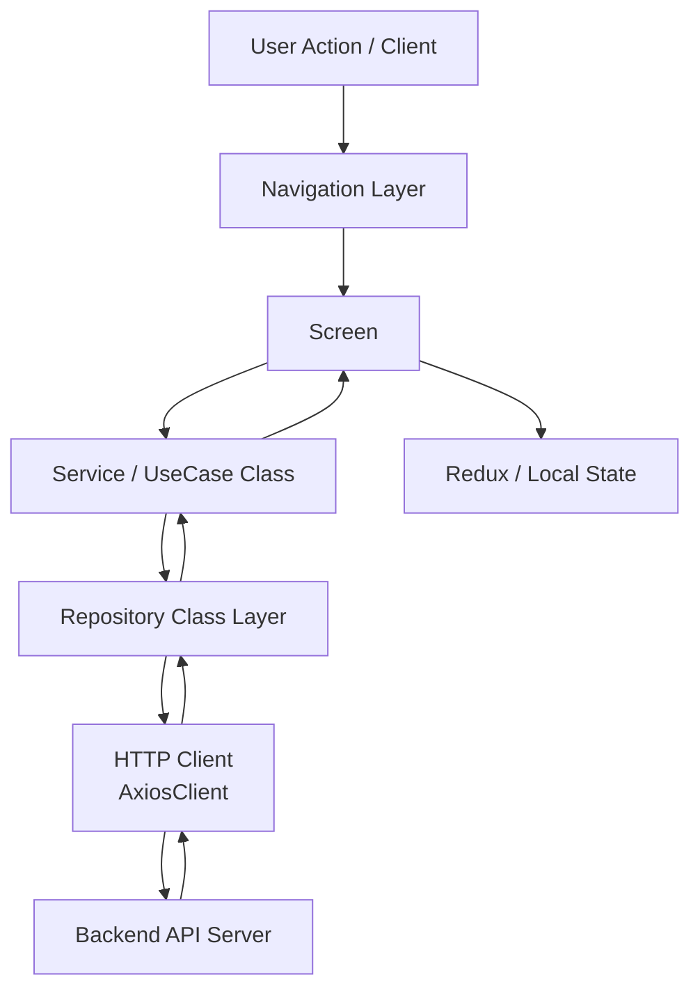

## 1. 개요

#### 프로젝트 목적
- 반려동물 동반 생활에 필요한 정보(숙소/장소/콘텐츠)를 분산된 채널에서 찾는 불편을 줄이고, 탐색부터 예약/리뷰까지 하나의 앱 플로우로 연결하기 위해 개발
- 위치 기반 탐색, 사용자 맞춤 콘텐츠, 커뮤니티 기능을 결합해 재방문율과 체류 시간을 높이는 것을 목표로 함

#### 타켓 사용자
- 반려동물과 함께 외출/여행하는 반려인
- 반려동물 동반 가능 장소 및 숙소 정보를 빠르게 찾고 싶은 사용자

---

## 2. 주요 업무 및 성과
- 누적 회원 수 약 **120,000명** 초과 / **MAU 6만** 이상 달성 / 앱 누적 다운로드 수 **53만건** 달성에 기여함
- Hermes 엔진 도입으로 앱 용량 **약 40% 감소**시킨 경험 (35MB → 약 20MB)
- 환경별 빌드/배포(EAS) 및 운영 구조(beta/stage/prod) 정립

---

## 3. 시스템 구조 / 아키텍처

- 전체 흐름
  - `App Bootstrap` -> `Navigation` -> `Screen(View)` -> `Use Case(Service)` -> `Repository` -> `API Server`
- 데이터 흐름 요약
  - Screen은 입력/출력만 담당하고 도메인 처리 로직은 Service/Repository 클래스로 위임
  - Repository 클래스가 AxiosClient와 결합해 API 요청 책임을 일원화
  - 응답 JSON을 Entity/Domain 클래스 인스턴스로 매핑해 로직을 캡슐화
  - 클래스 경계(화면/도메인/인프라) 분리로 변경 영향 범위를 최소화

---

## 4. 상세 기능 구현

**1) Repository/Service/ViewModel 클래스 분리**
- `Entity / Domain / Repository / Service / ViewModel`를 **클래스 단위로 분리**해 책임(역할)을 명확히 설계
- `class-transformer`로 API 응답을 단순 JSON이 아닌 클래스 인스턴스로 매핑해 **도메인 로직 캡슐화**
- 상속/조합 기반 재사용 구조를 통해 기능 확장 시 변경 범위를 줄이고 **유지보수성과 테스트 용이성** 강화

**2) 위치 기반 탐색 (내주변/지도)**
- 사용자 위치를 기반으로 주변 장소를 조회하고 카테고리별 탐색 제공
- "지금 갈 수 있는 곳" 탐색 시간을 줄여 사용자의 즉시 행동을 유도
- `AroundPlaceRepository`와 도메인 모델 클래스를 분리해 조회/가공 책임을 캡슐화

**3) 숙소/장소 상세 및 예약 연계**
- 리스트 -> 상세 -> 객실/옵션 -> 예약 완료까지 흐름 연결
- 전환 구간에서 이탈을 줄이기 위해 화면 간 정보 전달을 일관되게 유지
- 예약 상태/정책을 도메인 클래스와 enum으로 관리해 비즈니스 규칙 변경 대응력 확보

**4) 사용자 본인 인증 기능**
- 휴대폰 번호를 통한 인증 기능을 구현하고, 사용자 맞춤형 서비스 제공을 통한 마케팅 효과 창출
- 결제시 본인인증(성인)여부 확인 후, 결제 프로세스 진행하도록 개발해 보안을 강화

**5) 푸시 알림 및 딥링크**
- 사용자 맞춤 개인 푸시를 이용해 사용자 앱 사용 참여 유도 - 푸시 도입 이전 대비 **MAU가 약 10%이상 증가**
- payload 파싱을 전용 응답 클래스(`PushNotificationResponse`)로 처리해 라우팅 안정성 강화

**6) 초기화/캐시/에러 모니터링**
- 앱 시작 시 세션/위치/알림 초기화 + 폰트/이미지 캐시
- Sentry 기반 오류 수집 및 네트워크 예외 핸들링으로 안정성 개선
- Device/Notification/Location Context를 객체로 분리해 플랫폼 의존 로직 테스트 용이성 개선

---

## 5. 기술적 도전 및 해결

**1) 계층 구조 혼재 문제**
- **문제**: 레거시 JS와 신규 TS가 공존하면서 화면에서 API를 직접 호출하는 구간이 생겨 유지보수가 어려웠음.
- **해결**: `Screen -> Service(UseCase) -> Repository` 호출 경로를 기준 구조로 정리하고, `class-transformer`로 응답을 도메인 클래스 인스턴스로 매핑함.
- **결과**: 화면/비즈니스/데이터 접근 책임이 분리되어 기능 확장 시 사이드 이펙트가 줄고 코드 변경 범위 예측이 쉬워짐.

**2) 푸시/딥링크 재진입 실패 문제**
- **문제**: 푸시 클릭이나 딥링크 진입 시 네비게이션 준비 타이밍에 따라 목적 화면 이동이 실패할 수 있었음.
- **해결**: navigation ready 대기 후 라우팅하도록 처리하고, payload 파싱/라우팅 규칙을 일관되게 적용함.
- **결과**: 재진입 안정성이 높아졌고, 사용자 컨텍스트 손실이 줄어 UX 일관성이 개선됨.

**3) 앱 초기 구동 품질 문제**
- **문제**: 앱 시작 시 세션/알림/위치/리소스 초기화가 한 번에 실행되어 cold start 체감 품질이 떨어질 수 있었음.
- **해결**: 스플래시 구간의 초기화 순서를 재정의하고 폰트/이미지 캐시를 선처리함. 동시에 Sentry/Analytics로 오류와 사용자 흐름을 관측 가능하게 구성함.
- **결과**: 초기 진입 안정성이 개선되고, 운영 중 이슈 원인 파악 및 대응 속도가 향상됨.

---

## 6. 기술 스택
- **Frontend**: React Native, Expo, TypeScript
- **상태/데이터 관리**: Redux, Redux Thunk
- **테스트**: Jest
- **모니터링/분석**: Sentry, Amplitude, GA4, GTM, 네이버 애널리틱스
- **협업 도구**: Figma, Github

---

## 7. 회고

- 아쉬웠던 점
  - JS/TS 혼합 구조와 legacy 계층 공존으로 일관된 개발 경험 확보가 어려움
  - 테스트 커버리지가 핵심 비즈니스 플로우 대비 충분하지 않음

- 다시 만든다면 개선 하고 싶은 부분
  - 핵심 플로우 E2E/통합 테스트 확대
  - 성능 관측 지표(startup time, screen transition) 수집 체계화