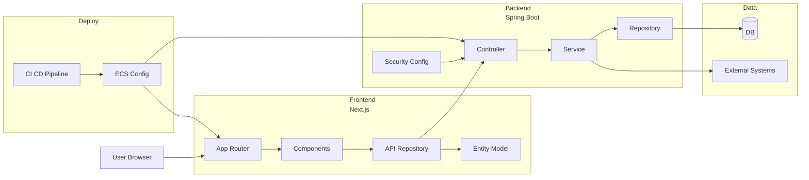

## 1. 개요

### 프로젝트 목적
- 기존 반려생활 앱 서비스를 웹으로 확장하여, 반려동물 동반 숙소 예약부터 결제까지 웹에서 완료할 수 있도록 구현
- 사용자의 예약 흐름을 단순화하고, 검색/결제/인증 경험을 안정적으로 제공

### 서비스 링크
- https://www.ban-life.com/

### 팀 구성 및 역할
- 팀 구성: FE 1명, BE 2명, 기획 1명, 디자인 1명
- 역할: 팀원으로 참여, 프론트엔드 개발 기여도 100%

---

## 2. 주요 업무 및 성과

- 서비스 런칭 후 2개월 동안 **MAU 120,000**, **트래픽 세션 수 200,000** 기록
- 기획, 개발, QA, 배포 전 과정에 참여하며 직군 간 협업 및 커뮤니케이션 주도
- **Sentry**, **Amplitude**를 활용한 에러 및 로그 관리 체계 운영
- **Figma** 기반으로 디자인 팀과 실시간 협업하여 UI 구현 정합성 확보
- **TanStack Query**, **Zustand**로 서버/클라이언트/전역 상태를 분리해 유지보수성 개선

---

## 3. 아키텍처 및 협업 방식

### 프론트 레이어 구조 (Next.js App Router)

- **레이어 규칙**: `app(라우팅) -> components(UI) -> repository(API 호출) -> entity(도메인 모델)`
- 백엔드(Spring Boot)와 요청/응답 스펙을 기준으로 협업해 개발-테스트-QA 단계의 커뮤니케이션 비용을 절감
- API 문서(REST Docs) 기반으로 프론트 구현과 QA 시나리오를 정렬해 릴리즈 전 검증 품질을 높임
- 배포 시 환경별 설정과 지표(에러/행동 로그) 점검 절차를 운영해 릴리즈 리스크를 관리

### 기술 설계 포인트
- **상태 책임 분리**: 서버 상태는 **TanStack Query**, 화면/단계 상태는 **Zustand**로 분리해 데이터 흐름을 단순화
- **멀티 스텝 안정화**: 검색→인증→예약→결제를 모달형 단계 플로우로 구성하고 상태 저장/복원으로 뒤로가기/새로고침 이슈를 완화
- **정합성 검증**: 인증 복귀, 가격 재계산, 결제 진입 시 공통 검증 로직을 적용해 단계 불일치와 금액 오차를 방지
- **운영 관찰성 확보**: **Sentry**와 **Amplitude/GA4/GTM**를 결합해 장애 탐지와 사용자 이탈 분석 사이클을 단축

---

## 4. 상세 기능 구현

**1) 결제 기능**
- 예약 및 결제 프로세스를 설계하고 사용자 흐름에 맞춰 프론트엔드 기능 구현
- 예약 단계 이탈을 줄일 수 있도록 결제 경험을 안정적으로 제공

**2) 사용자 본인 인증 기능**
- 나이스 아이디 본인 인증을 팝업 방식으로 구현
- 인증 완료 후 웹 서비스로 자동 리디렉션 처리해 인증 완료 흐름을 간소화

**3) 숙소 검색 필터링 기능**
- 1박 가격, 반려동물 타입, 몸무게 등 복수 조건 기반 필터링 기능 구현
- 사용자 상황에 맞는 맞춤형 검색 경험을 제공해 탐색 효율 향상

**4) SEO 최적화 설정**
- Next.js 메타데이터 방식을 활용해 OG 이미지, 파비콘, 사이트맵 구성
- 구글 스니펫 노출 가능성을 높이기 위해 **JSON-LD** 구조화 데이터 적용
- 네이버 애널리틱스, GA4, GTM 연동으로 분석 및 마케팅 의사결정 기반 마련

---

## 5. 도메인별 기여 범위

- 회원/인증: 로그인/회원가입/인증 연동 화면 및 인증 완료 플로우 구현
- 검색/숙소/객실: 조건 기반 검색, 리스트/상세 화면, 필터 UX 구현
- 예약/결제/취소: 예약 정보 입력부터 결제/결과 화면까지 사용자 흐름 구현
- 쿠폰/프로모션: 결제 단계 쿠폰 적용 관련 화면/상태 처리
- 마이페이지: 사용자 정보/예약 내역/쿠폰 관련 사용자 중심 화면 구성

---

## 6. 기술적 도전 및 해결

1. **멀티 스텝 상태 유실 방지**
- **문제:** 검색→인증→예약→결제 진행 중 뒤로가기/새로고침 시 입력값이 초기화되어 이탈 위험이 증가
- **해결:** 플로우를 모달형 단계 구조로 재설계하고, 단계별 상태를 내부 스토어에 저장/복원하도록 구현

2. **인증/결제 구간 상태 정합성 확보**
- **문제:** 외부 본인인증 팝업 복귀 시 단계 상태와 UI 표시가 어긋나 결제 진입 조건 불일치 발생
- **해결:** 인증 복귀, 가격 계산, 결제 진입 시점에 공통 검증 로직을 적용해 상태 일관성 유지

3. **상태 구조 단순화와 운영 대응 속도 개선**
- **문제:** 서버 데이터와 UI 상태가 섞이면 변경 영향 범위가 커지고 장애 원인 파악이 지연됨
- **해결:** 서버 상태는 **TanStack Query**, 화면/단계 상태는 **Zustand**로 분리하고 **Sentry/Amplitude**로 모니터링 체계 운영

---

## 7. 기술 스택

- **Frontend**: React, Next.js 14, TypeScript
- **UI**: Tailwind CSS
- **상태/데이터 관리**: TanStack Query, Zustand
- **모니터링/분석**: Sentry, Amplitude, GA4, GTM, 네이버 애널리틱스
- **협업 도구**: Figma, Github

---

## 8. 회고

- FE 1인 역할로 기능 구현뿐 아니라 QA/배포까지 폭넓게 담당하며 서비스 전체 흐름을 경험
- 상태 관리와 분석 도구를 함께 설계/운영하며, 개발 생산성과 운영 관찰 가능성을 동시에 확보
- Amplitude 같은 마케팅 툴을 직접 분석하고 활용해본 경험
